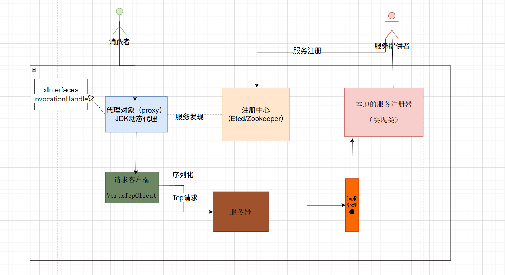

## RPC
RPC（Remote Procedure Call，远程过程调用）是一种计算机通信协议，允许程序像调用本地函数一样调用另一台计算机（或网络中的其他进程）上的函数或服务，而无需显式处理网络通信的细节。
# hao-rpc
从零实现RPC

hao-RPC(远程过程调用框架)基于Java+Etcd+Vert.x实现,支持通过SPI机制动态扩展，支持注解和配置快速调用框架。
## 框架图

## hao-rpc核心
- 接口Mock 
   &nbsp;&nbsp;&nbsp;&nbsp;RPC 框架的核心功能是调用其他远程服务。但是在实际开发和测试过程中，有时可能无法直接访问真实的远程服务，或者访问真实的远程服务可能会产生不可控的影响，例如网络延迟、服务不稳定等。在这种情况下，就需要使用 mock 服务来模拟远程服务的行为，以便进行接口的测试、开发和调试。  
- 序列化器 
   &nbsp;&nbsp;&nbsp;&nbsp;Java 对象是存活在 JVM 虚拟机中的，如果想在其他位置存储并访问、或者在网络中进行传输，就需要进行序列化和反序列化。  
- SPI机制 
   &nbsp;&nbsp;&nbsp;&nbsp;SPI（Service Provider Interface）服务提供接口是 Java 的机制，主要用于实现模块化开发和插件化扩展。  
   &nbsp;&nbsp;&nbsp;&nbsp;SPI 机制允许服务提供者通过特定的配置文件将自己的实现注册到系统中，然后系统通过反射机制动态加载这些实现，而不需要修改原始框架的代码，从而实现了系统的解耦、提高了可扩展性。  
- 注册中心 
   &nbsp;&nbsp;&nbsp;&nbsp;数据分布式存储：集中的注册信息数据存储、读取和共享
   &nbsp;&nbsp;&nbsp;&nbsp;服务注册：服务提供者上报服务信息到注册中心
   &nbsp;&nbsp;&nbsp;&nbsp;服务发现：服务消费者从注册中心拉取服务信息
   &nbsp;&nbsp;&nbsp;&nbsp;心跳检测：定期检查服务提供者的存活状态
   &nbsp;&nbsp;&nbsp;&nbsp;服务注销：手动剔除节点、或者自动剔除失效节点  
- 自定义协议  
  - 自定义网络传输
      &nbsp;&nbsp;&nbsp;&nbsp;使用传输层的Tcp协议  
  - 自定义消息结构
      
      - 魔数：作用是安全校验，防止服务器处理了非框架发来的乱七八糟的消息（类似 HTTPS 的安全证书）
      - 版本号：保证请求和响应的一致性（类似 HTTP 协议有 1.0/2.0 等版本）
    - 序列化方式：来告诉服务端和客户端如何解析数据（类似 HTTP 的 Content-Type 内容类型）
    - 类型：标识是请求还是响应？或者是心跳检测等其他用途。（类似 HTTP 有请求头和响应头）
    - 状态：如果是响应，记录响应的结果（类似 HTTP 的 200 状态代码）  
- 负载均衡 
   &nbsp;&nbsp;&nbsp;&nbsp;从服务提供者（多个服务提供者）节点中，选择一个服务提供者发起请求，而不是每次都请求同一个服务提供者，这个操作就叫做负载均衡。  
- 重试 
   &nbsp;&nbsp;&nbsp;&nbsp;调用接口失败可能有很多原因，有时可能是服务提供者返回了错误，但有时可能只是网络不稳定或服务提供者重启等临时性问题。这种情况下，我们可能更希望服务消费者拥有自动重试的能力，提高系统的可用性。
